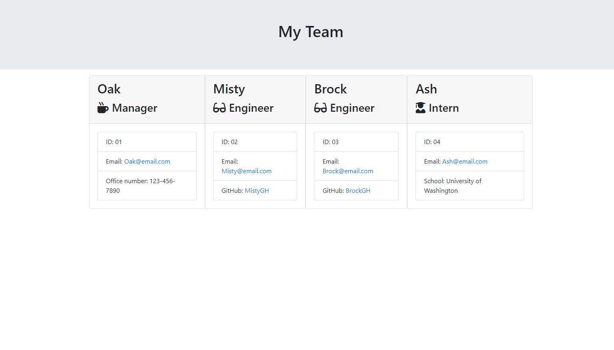

# Team Card Builder!

## Description
This application creates a profile card for each member in your team! Each card has the name, email, and id number of the team member along with their role in the team. Each profile card will have additional information depending on the members role. The manager profile will consist of the office number, the engineer profile will have their github username, the intern profile will have the school they attended. 
        
## Table of Contents
- [Installation](#installation)

- [Usage](#usage)

- [License](#license)

- [Video](#video)

- [Test](#test)

- [Contributors](#contributors)

- [Questions](#questions)

    
## Installation
In the integrated terminal, the user must install inquirer to be able to run the application.

## Usage
Open the integrated terminal by right clicking on the app.js, in the command line, type npm install and wait for installations to complete. Once finished, type node app.js and answer the following prompts! Once all team members have been added, answer "No" to the prompt "Would you like to add another employee" and the html file will be created in the /ouput folder. Right click on the team.html within the output folder and open in default web browser to view the profile cards!
        
## License
This project uses MIT

## Video

## Test
To run the tests, open the integrated terminal and type npm run test.

## Contributors
Jae Kim

## Questions
View my other projects!

https://github.com/JSK321

Have any questions?

Email me at: jaeshinkim321@gmail.com